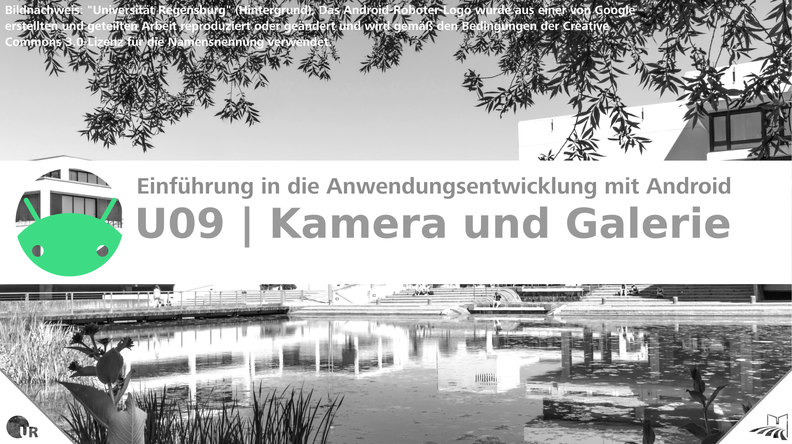
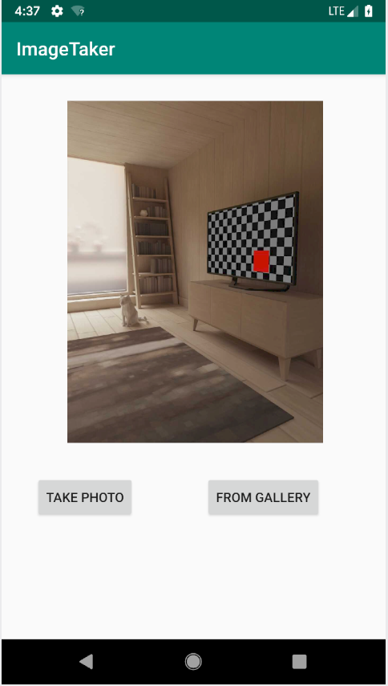
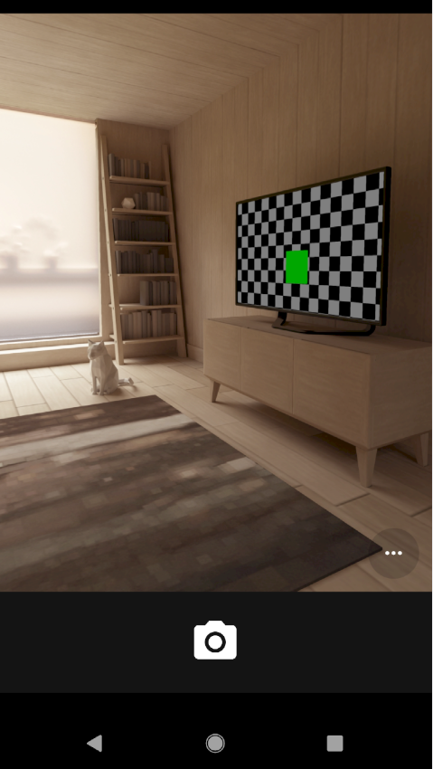
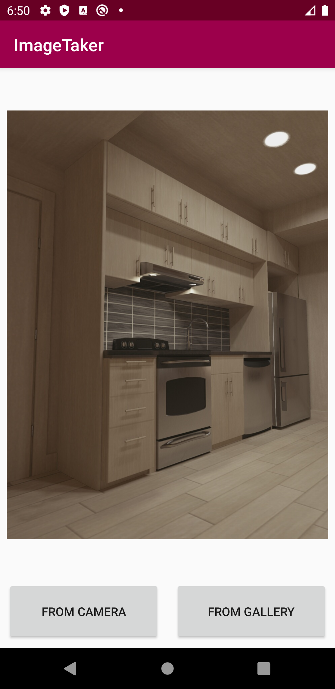

# U09 | Kamera und Galerie



## Aufgabe

Im Rahmen dieses Übungsblattes ist eine App (`ImageTaker`) zu entwickeln, in der Sie Bilder anzeigen lassen können. Das darzustellende Bild soll dabei entweder frisch mit der Kamera des Gerätes aufgenommen werden oder es soll ein bereits auf dem Gerät gespeichertes Bild ausgewählt werden. Das Aufnehmen und Verwalten von Bildern soll dabei nicht selbst implementiert werden. Stattdessen wird die (jeweils auf dem System installierte) Kamera- bzw. Galerie-App von Android ein Bild an die eigene App liefern. (Fast) Jedes Android-Gerät hat eine oder mehrere Apps für diese Zwecke bereits vorinstalliert.  
Sie können Ihre App natürlich auch auf dem Emulator testen. Sofern Sie die Kamerafunktionalität bei der Erstellung Ihres AVDs nicht deaktiviert haben, haben Sie die Möglichkeit Bilder in einer virtuellen Szene aufzunehmen (vgl. Screenshot-2).  
Wenn Sie einen Emulator verwenden, wird Ihre Galerie vermutlich leer sein. Um die Verwendung der Galerie später testen zu können, bietet es sich an, die Kamera-App Ihres emulierten Gerätes manuell zu starten und ein paar Bilder aufzunehmen. Alternativ können Sie die Kamerafunktion Ihrer ImageTaker-App so erweitern, dass die aufgenommen Bilder nicht nur in Ihrer App angezeigt werden, sondern auch zur Galerie hinzugefügt werden. 

## Hinweise

* Verwenden Sie die Vorlesung (vor allem VL8), sowie die Android Dokumentation, um die gewünschten Features zu implementieren. Eine gute Anlaufstelle ist dabei dieser Guide zur Einbindung der Kamera:  
https://developer.android.com/training/camera/photobasics   
* Vergessen Sie nicht, die notwendigen Berechtigungen im Android Manifest anzugeben.  
* Versuchen Sie Schritt für Schritt die Teilprobleme zu lösen und in einzelne Methoden auszulagern. Fangen Sie damit an zuerst ein Thumbnail ihres geschossenen Fotos darzustellen und erweitern sie Schritt für Schritt die zu implementierenden Features.  
  
## Ausgangslage

Für die Bearbeitung dieser Aufgabe wurde nichts vorgegeben, das Starterpake entspricht einem frisch generierten Projekt mit einer *Empty Activity*. In der Gestaltung Ihres UIs sind Sie frei. Auf den Screenshots sehen Sie einen schlichte Umsetzung (zwei Buttons und ein `ImageView`), aber das heißt nicht, dass Sie sich bei Gestaltung des Layouts auf einfache Buttons beschränken müssen.
   
## Weiter Hinweise zur Bearbeitung

* Der Aufruf externer Apps erfolgt hier in beiden Fällen (Kamera und Galerie), indem Sie einen entsprechenden `Intent` gemeinsam mit einem selbstgewählten *request code* an die Methode `startActivityForResult(Intent intent, in requestCode)` übergeben. Die Erstellung des `Intent`-Objekts variiert hier jedoch je nach Anwendungsfall. Für die Erzeugung des Intents zum Aufruf der Kamera können Sie sich an den Codebeispielen der Vorlesung oder des verlinkten Guides orientieren. Für den Aufruf der Galerie (oder einer App mit vergleichbarer Funktionalität) können Sie Ihr `Intent`-Objekt folgendermaßen erzeugen:  
```
Intent loadImageIntent = new Intent(Intent.ACTION_PICK,
  MediaStore.Images.Media.EXTERNAL_CONTENT_URI);
```  
* Im verlinkten Guide finden Sie eine Anleitung, wie Sie einen `FileProvider` im Manifest registrieren. Die dabei verwendete Support-Library ist nicht mehr ganz aktuell.  
Statt `android.support.v4.content.FileProvider` können Sie  
`androidx.core.content.FileProvider` für das Attribut `android:name` angeben.  

* Die Vielfalt der Gerätelandschaft von Android bedingt, dass es immer wieder zu unerwarteten, hardwarebedingten Engpässen kommen kann. `Bitmap`-Objekte werden zunächst (unabhängig von ihrer letztendlichen Darstellungsgröße in der App) in ihrer Originalgröße im Speicher gehalten. Auch wenn nicht unbedingt damit zu rechnen ist, dass es im Kontext dieser Übungsaufgabe zu einem Absturz aufgrund einer Speicherüberschreitung kommt, da immer nur ein Bild dargestellt wird, können Sie sich bereits im Rahmen dieser Aufgabe daran versuchen, die Gefahr einer Speicherüberschreitung zu minimieren. Suchen Sie dazu nach einem Ansatz, der es Ihnen erlaubt, Bitmaps so zu erzeugen, dass die Größe bereits auf die Größe des `ImageView`-Elements skaliert ist.  

## Anhang
### Screenshots

| | | |
|-|-|-|
|{ height=8cm } |{ height=8cm } |{ height=8cm }|
